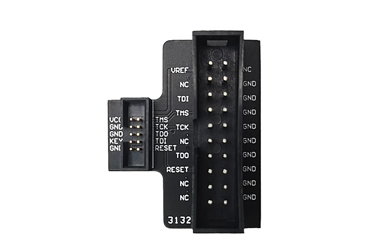

# 项目背景
做为一个嵌入式软件工程师除去集成开发环境（IDE）不讲，其使用最多的工具为：
1. 调试器/仿真器：调试器和仿真器用于连接到目标嵌入式系统，以便实时监视程序的执行和内部状态。通过这些工具，工程师可以进行代码单步执行、变量查看和硬件寄存器调试等。常用的调试器有： 
- Segger J-Link 
- ST-Link
- Black Magic Probe
- DAP-Link
2. 串口工具:将调试信息（例如变量值、状态信息、错误消息等）通过串口发送到主机。这些信息将帮助工程师了解嵌入式系统的运行状态和问题。（串口调试在嵌入式系统开发中是一种比较基础的调试方法。在实际的应用中，可能会使用更高级的调试工具和方法，例如使用调试器连接到目标板进行硬件级别的调试，或者使用RTT（Real-Time Transfer）等更高级的调试技术）
目前主要采用usb2ttl模块，主流芯片为:
- cp210x
- 国产沁恒居多。

## 开发场景
日常的开发仅需一个调试器及一个串口模块即可；但对于模组开发、多CPU/多板间通信开发，我们可能需要多套调试器、串口模块。因此需要:
- 更多的USB端口来连接调试工具；因此你可能需要额外的USB HUB。
- 更多的杜邦线连接开发板
- 昂贵的调试器(如J-LINK)你可能需要配置多个

## PicoXTools拥有的资源&功能
### J-LINK 接口转换

参考了网上的实现
    
    

PicoXTools 可以直接插入J-LINK的20针公口排针上。无需额外的排线连接；通过 双刀四掷模拟开关实现（SWD/cJTAG）1拖四的功能。当然在某一时刻仅有一路处于ACTIVE状态

### Arm开发板：
> 较优异的性能，良好的社区环境，
> i.max RT 系列SOC是理想的平台，资源丰富，但考虑到目前的价格、PCB的难度，作为软件工程师似乎难于驾驭，最终选择树梅派RP2040 ，RP2040的主要特点包括：
>1. 双核m0+的内核，可以运于100+Mh，
>2. 存储器：它内置264KB的SRAM
>3. RP2040支持USB连接，可以同时作为USB主机或USB设备，TinyUSB 良好的移植
>4. PIO（Programmable Input/Output）可以模拟多种外设如 eth mac ,vga,hdmi等专有外设,这个必须给赞，5元能买到FPGA的功效。
>5. 极好的社区支持、有大量的极客基于其开发出一些有趣的项目如：示波器、逻辑分析仪等

### DAP-Link
> 树莓派官方实现的DAP-Link（pic-proble） 可以用来调试RP2040本身，结合open-ocd可以调试更多种类的MCU。
> 通过拨盘& 双刀四掷模拟开关可对四目标设备进行选择调试
> 当插入外接JLINK时(通过JLINK第二脚的VCC 高电平来判断）PicoXTools的四路 SWD/cJTAGE 引脚会路由到外部的JLINK，而不是pic—probe.

### 4Port USB2.0 
> PicoXTools 拥有一个4Port USB2.0 HUB，其中两个分别用于 rp2040与以ch344 ,余下的两个端口可用于外接USB设备，接口类型为TYPE-C

### 4 Port 独立硬件USB to TTL
> rp2040有usb接口可以通过软件的方式来实现usb to ttl为什么还要采用独立硬件来实现呢，做为一个开发工具,cpu(rp2040)异常时没有串口输出是不是很尴尬，
因此采用了独立的CH344Q 芯片挂接到USB-HUB上，独立于SOC。同时你可以通过软件组合pico的PIO增加额外的串口接口。

### USB 转I2C
通过rp2040的usb，我们可以通过上位机来操作rp2040 硬件I2C接口来调试扩展板上的I2C设备如温湿度传感器、SS1306 OLED等。
### USB 转SPI
通过rp2040的usb，我们可以通过上位机来操作rp2040 硬件SPI接口来调试扩展板上的SPI设备如Lora 模组等

# PicoXTools 功能图

# PicoXTools PCB

# 实物图

# 软件部分
## 小而美的CLI(命令行) 
- 可方便扩充命令
- 集成littlefs ,支持基本文件系统命令：ls\cd\copy\rm\mkdir等。
- 移值了busybox的vi 没错你可以用vi 在线修改程序、配置文件等。
- 支持X、YModem协议传输文件。
- 基于AMaCC(https://github.com/jserv/amacc)  和 C4(https://github.com/rswier/c4)的即时（JIT）CC编译器,
    > 生成的文件可以在PicoXTools shell上直接执行。
- 支持的胶水语言
  > 1. Python
    这个自不必多说，pico原生支持python开发
  > 2. Lua
    与C结合度最高的脚本语言
  > 3. C (基于AMaCC&c4)胶水语言的尽头是C
  > 2. Javascript
    JavaScript是开发语言中使用最广泛使用的编程语言（好吧，我加个'之一'）。它是一种高级的、动态的、弱类型的编程语言，广泛用于：
    >>  - Web前端和后端开发，
    >>  - 移动应用
    >>  - 桌面应用
    >>  - 数据可视化（如D3.js）
    >>  - 游戏开发
    >>  - 云计算和物联网
    此处我们主要介绍JS在嵌入式领域的应用
    
# 致谢🙏
项目没有从0造轮子，认真的拥抱了开源社区，开源社区为我们提供了宝贵的资源和工具。数以千计的开源库、框架和工具，涵盖了从前端到后端、从数据库到人工智能的各个领域。拥有这些开源资源，我们可以站在巨人的肩膀上，快速构建功能丰富、高效稳定的应用程序。
感谢如下的项目：
- [pshell](https://github.com/lurk101/pshell) 非常nice的pico shell 
- [AMaCC](https://github.com/jserv/amacc)
- [C4](https://github.com/rswier/c4)
- [FreeRTOS](https://github.com/FreeRTOS/FreeRTOS-Kernel)

# 视频展示
- Shell && vi && cc 
> https://ppvision.github.io/video/shell_vi_cc_demo.mp4
> 

# ToDO List
## 其于Web技术WebSerial的串口助手的实现。
- 实现一些常用串口协议的解析&调试Modebus等

