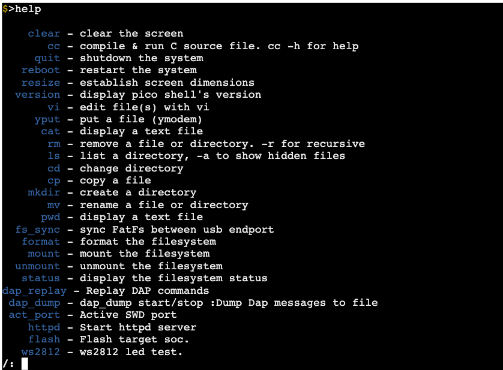
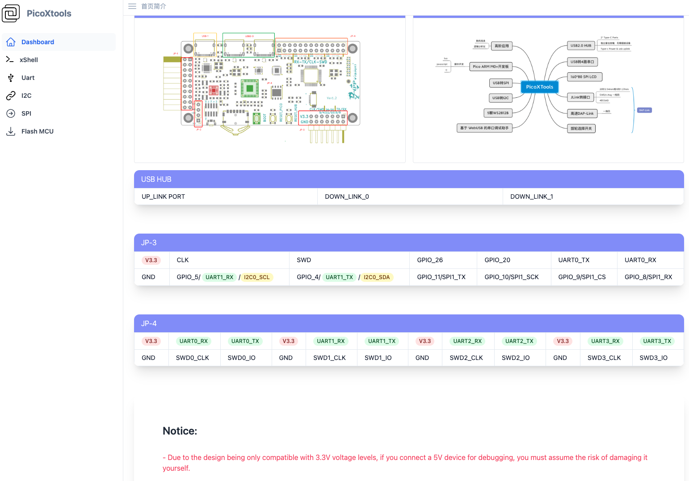
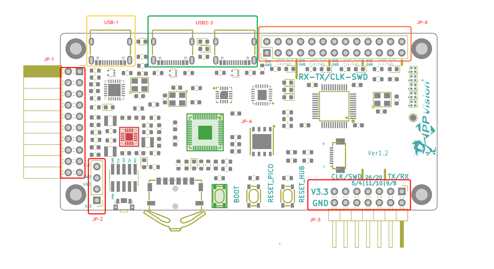

## [中文版本](./README.zh.md)

# Project Background
As an embedded software engineer, one of the most commonly used tools, in addition to the integrated development environment (IDE), is:
1. Debugger/Emulator: Debuggers and emulators are used to connect to the target embedded system to monitor real-time program execution and internal states. Through these tools, engineers can schedule code execution step by step, view variables, and debug hardware registers, among other things. Common debuggers include:
   - Segger J-Link
   - ST-Link
   - Black Magic Probe
   - DAP-Link
2. Serial Tools: Serial tools are used to send debugging information (such as variable values, status information, error messages, etc.) over a serial connection to a host computer. This information helps engineers understand the operational status of the embedded system and identify issues. (Serial debugging is a fundamental debugging method in embedded system development. In practical applications, more advanced debugging tools and methods, such as using a debugger to connect to the target board for hardware-level debugging or using Real-Time Transfer (RTT) and other advanced debugging techniques, may be used.)

Currently, the main USB to TTL modules used are USB2TTL modules, with the main chips being:
- cp210x
- Mostly domestically produced CH340.

# Development Scenarios
For everyday development, only one debugger and one serial module are required. However, for module development and development involving multiple CPUs/multiple boards, multiple sets of debuggers and serial modules may be needed. Your USB hub provides only a limited number of ports.
Challenges to address:
- The need for more USB ports to connect debugging tools; therefore, an additional USB HUB may be required.
- More DuPont wires to connect development boards.
- Expensive debuggers (such as J-LINK) may need to be configured for multiple instances.

# PicoXTools Functional Diagram

# Physical Appearance

# Hardware Section
## J-LINK Interface Conversion

Referenced internet implementation

PicoXTools can be directly inserted into the 20-pin male header of J-LINK. No additional ribbon cable connection is required; 1-to-4 functionality is achieved through a dual-pole four-throw simulated switch (SWD/cJTAG), with only one channel being active at any given moment.

## PicoXTools Itself Is an Arm Development Board:
> Excellent performance, a thriving community environment,
> Based on Raspberry Pi RP2040, the main features of RP2040 include:
> 1. Dual-core M0+ cores capable of running at over 133MHz.
> 2. Memory: It has 264KB of SRAM built-in.
> 3. RP2040 supports USB connectivity and can act as both a USB host and USB device, with good portability for TinyUSB.
> 4. PIO (Programmable Input/Output) can emulate various peripherals such as Ethernet MAC, VGA, HDMI, and other proprietary peripherals, similar to FPGA functionality.
> 5. Excellent community support with numerous geeks developing interesting projects based on it, such as oscilloscopes and logic analyzers.

## DAP-Link Functionality
> The DAP-Link (pic-probe) officially implemented by Raspberry Pi can be used to debug RP2040 itself. Combined with OpenOCD, it can debug a wider range of MCUs.
> Four target devices can be selected for debugging through a dial and a dual-pole four-throw simulated switch.
> When an external JLINK is inserted (determined by a high level on the second pin of JLINK's VCC), PicoXTools' four SWD/cJTAGE pins will be routed to the external JLINK instead of pic—probe.

## 4 Port USB 2.0
> PicoXTools features a 4-port USB 2.0 HUB, with two of them dedicated to the RP2040 with ch344 and the remaining two ports available for external USB devices, with a mainstream TYPE-C interface.

## 4 Independent Hardware USB to TTL Ports
> While RP2040 has a USB interface that can implement USB to TTL through software, it is embarrassing not to have serial output when RP2040 goes awry as a development tool. Therefore, an independent CH344Q chip is attached to the USB-HUB, separate from the SOC. Of course, you can add additional serial interfaces using software and Pico's PIO.

## USB to I2C
We can use the built-in Web Server to operate the RP2040 hardware I2C interface and debug I2C devices on the expansion board, such as temperature and humidity sensors, SS1306 OLED displays, etc.

## USB to SPI
We can use the built-in Web Server to operate the RP2040 hardware SPI interface and debug SPI devices on the expansion board, such as LoRa modules.

## Independent RP2040 Reset Button
## Independent USB HUB Reset Button

# Software Section
## A Small Yet Powerful CLI (Command Line Interface) with Abundant Commands Built-In
- Easily extensible commands
- Command completion
- Command history
- Integrated littlefs/Fatfs, supporting basic file system commands such as ls, cd, copy, rm, mkdir, etc.
- Includes a Vi editor based on busybox, allowing you to directly edit programs and configuration files in the command line using vi.
- Supports X and YModem protocol file transmission.
- NDIS/ECM network card and MSC disk based on TinyUSB
- Offline burning
- A JIT C compiler based on AMaCC (https://github.com/jserv/amacc) and C4 (https://github.com/rswier/c4)
   > The generated files can be executed directly in the PicoXTools shell.
- Supported scripting languages
   > 1. Python
      This one goes without saying; Python is natively supported for Pico development.
   > 2. Lua
      The scripting language with the highest degree of integration with C.
   > 3. C (based on AMaCC & c4)
      The ultimate glue language is C.
   > 4. Javascript
      JavaScript is one of the most widely used programming languages in the development community. It is a high-level, dynamic, weakly typed programming language used extensively in:
      >> - Front-end and back-end web development
      >> - Mobile applications
      >> - Desktop applications
      >> - Data visualization (e.g., D3.js)
      >> - Game development
      >> - Cloud computing and the Internet of Things (IoT)
      In this context, we mainly discuss the application of JS in the embedded field.

## Built-In Web Server
- An xShell based on Websockets allows you to operate all PicoXTools functions through a web browser.

## Built-In C Language Compiler
Supports most of the standard library and PICO's SDK, allowing for quick API verification. You can compile and execute directly on Pico.

# PicoXTools PCB

## Pinout

### USB-1
Upstream interface for the HUB.
### USB2-3
USB HUB downstream ports.
### JP-1
Standard JTAG 20-pin female header