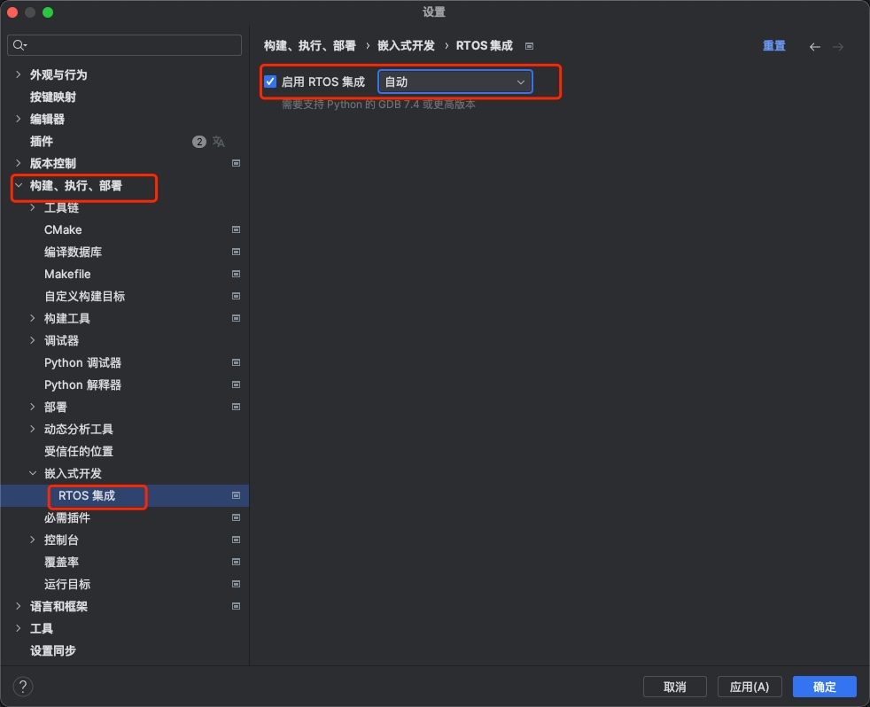
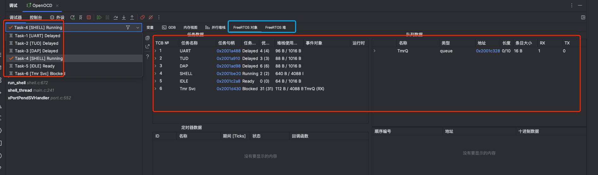
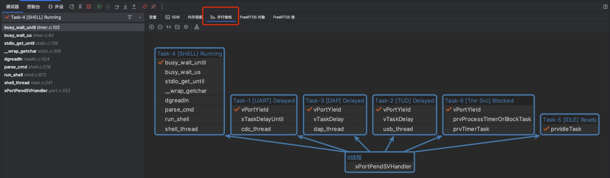
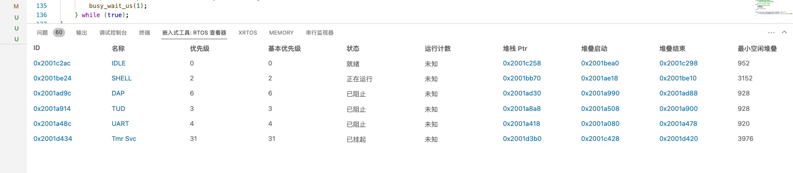
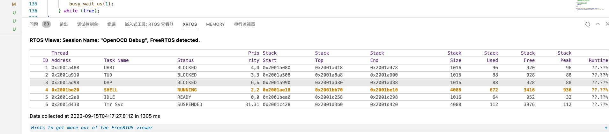

# Multi-threaded RTOS debug

## Clion
- 打开RTOS 线程查看器 
     Settings > Build, Execution, Deployment > Embedded Development > RTOS
    
- MacOS 下ArmGNUToolchain gdb放弃了对python的支持，但这是线程查看器必须的功能因此你必须:
    1. 自己编译gdb 打开对python的支持.
    2. 使用第三方的包如xpack (https://github.com/xpack-dev-tools/arm-none-eabi-gcc-xpack/releases/) 
- FreeRTOSConfig.h  打开一些定义如：
    1. configUSE_TRACE_FACILITY needs to be set to 1, to display task numbers and queue types.
    2. configRECORD_STACK_HIGH_ADDRESS needs to be set to 1, to display the task stack info
    3. configUSE_TRACE_FACILITY and configGENERATE_RUN_TIME_STATS to collect runtime info (runtime column of the task table)
- 图片
 
 


## VSCode
```json
{
    "version": "0.2.0",
    "configurations": [
        {
            "type": "cortex-debug",
            "name": "OpenOCD Debug",
            "cwd": "${workspaceFolder}",
            "executable": "${workspaceFolder}/build/PicoXTools_uart.elf",
            "request": "launch",
            "interface": "swd",
            "servertype": "openocd",
            "gdbPath" : "arm-none-eabi-gdb",
            "device": "RP2040",
            "runToEntryPoint": "main",
            "openOCDLaunchCommands": [
                "adapter speed 20000"
            ],
            "svdFile": "${env:PICO_SDK_PATH}/src/rp2040/hardware_regs/rp2040.svd",
            "postRestartCommands": [
                "break main",
                "continue"
            ],
            "configFiles": [
                "interface/cmsis-dap.cfg",
                "target/rp2040.cfg"
            ],
        },
        { //JLINK CONFIG
            "request": "launch",
            "type": "cortex-debug",
            "name": "Debug J-Link",
            "cwd": "${workspaceRoot}",
            "executable": "${workspaceFolder}/build/PicoXTools_uart.elf",
            "serverpath": "/Applications/SEGGER/JLink/JLinkGDBServerCLExe",
            "servertype": "jlink",
            "armToolchainPath": "/Applications/ARM/bin/",
            "device": "RP2040_M0_0",
            "interface": "swd",
            "serialNumber": "", //If you have more than one J-Link probe, add the serial number here.
            // "jlinkscript":"${workspaceRoot}/BSP/SEGGER/K66FN2M0_emPower/Setup/Kinetis_K66_Target.js",
            "runToEntryPoint": "main",
            "svdFile":"${env:PICO_SDK_PATH}/src/rp2040/hardware_regs/rp2040.svd"
          }
    ]
}
```
- 图片
 
 
